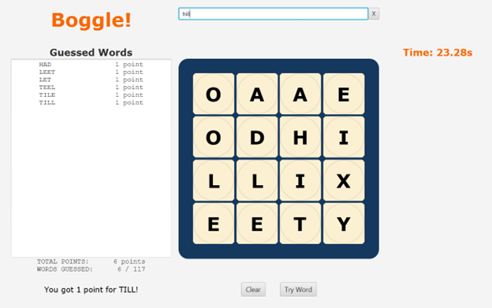
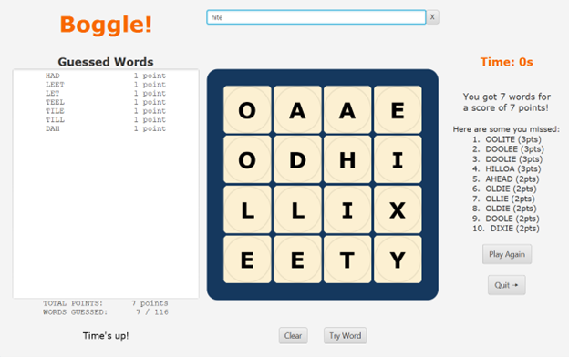

# Boggle!

A Boggle GUI built with JavaFX, and a recursive backgracking algorithm using a [Trie data structure](https://en.wikipedia.org/wiki/Trie) to find the best words you missed!





# Clone and run!

```
git clone git@github.com:jacksonthall22/boggle-gui.git && cd boggle-gui

# Install the JavaFX SDK for your system: https://gluonhq.com/products/javafx/
export PATH_TO_FX="C:\Program Files\Java\javafx-sdk-18.0.2\lib"  # Replace with actual path

# Compile and run
./play    # Unix-like
play.bat  # Windows
```

