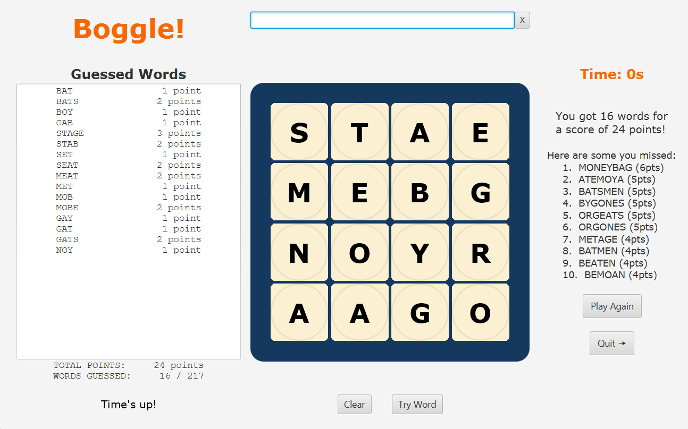

# Boggle!

A Boggle GUI built with JavaFX, and a recursive backgracking algorithm using a [Trie data structure](https://en.wikipedia.org/wiki/Trie) to find the best words you missed!




# Clone, compile, run!

```
git clone git@github.com:jacksonthall22/boggle-gui.git && cd boggle-gui

# Install the JavaFX SDK for your system: https://gluonhq.com/products/javafx/

export PATH_TO_FX="C:\Program Files\Java\javafx-sdk-18.0.2\lib"  # Replace with actual path
javac --module-path "$PATH_TO_FX" --add-modules javafx.controls,javafx.fxml -d out src/*.java
java --module-path "$PATH_TO_FX" --add-modules javafx.controls,javafx.fxml -cp out BoggleGUI
```


